# Uncertainty-Aware Digital Twin for 2D Heat Diffusion

This project is a compact scientific machine learning pipeline for a 2D heat-diffusion system. It simulates a physical process, trains neural surrogates, validates them against finite-difference data, calibrates an unknown physical parameter from sparse sensors, and estimates predictive uncertainty with an ensemble.

## Why This Project

Digital twins combine simulation, data, and model updating. In a real system, a high-fidelity simulator may be accurate but too slow to run repeatedly, while sensor data may be sparse and noisy. A useful surrogate should be fast, validated against simulation, and explicit about when it is less reliable.

This project mirrors that workflow on a controlled problem:

1. Generate synthetic simulation data from a known PDE.
2. Train a neural surrogate to approximate the simulator.
3. Evaluate in-distribution and out-of-distribution performance.
4. Recover an unknown physical parameter from sparse noisy observations.
5. Estimate uncertainty using an ensemble of independently trained models.

## Physical System

The system is a square 2D plate with heat diffusion and a fixed heater/source pattern:

```text
du/dt = alpha * laplacian(u) + q(x, y)
```

where:

- `u(x, y, t)` is temperature
- `alpha` is thermal diffusivity
- `q(x, y)` is the heater/source field

The simulator uses an explicit finite-difference solver on a `32 x 32` grid with zero-flux Neumann boundary conditions.

## Machine Learning Task

Each sample is converted into a supervised learning problem:

```text
Input X:  [initial temperature, heater/source field, alpha grid]
Shape:    [N, 3, 32, 32]

Target Y: final temperature field after simulation
Shape:    [N, 1, 32, 32]
```

The surrogate learns:

```text
G(u0, q, alpha) -> u(T)
```

## Repository Structure

```text
digital-twin-heat-surrogate/
  src/
    simulate.py              # finite-difference data generation
    dataset.py               # PyTorch Dataset and DataLoader utilities
    models.py                # CNN and FNO surrogate models
    train.py                 # training loop, metrics, checkpoints, logs
    train_fno.py             # convenience entry point for FNO training
    calibrate.py             # finite-difference sparse-sensor calibration
    surrogate_calibrate.py   # surrogate-vs-simulator calibration comparison
    uncertainty.py           # ensemble uncertainty estimation
  notebooks/
    01_synthetic_data_qc.ipynb
    02_run_results_analysis.ipynb
    03_compare_models.ipynb
  scripts/
    train.slurm
    train_fno.slurm
  figures/
  data/
  logs/
  checkpoints/
  results/
```

Generated data, logs, checkpoints, and raw results are ignored by Git so the repository stays lightweight. The README reports the main results and includes saved figures.

## Data Generation

The simulator creates several splits:

- `train`, `val`, `test`: centered heater patterns
- `ood_corner`: heater moved toward plate corners
- `ood_multi`: multiple heaters

The OOD splits are intentionally different from the training distribution. This lets me test whether the surrogate still performs well when the source pattern changes.

Generate data with:

```bash
python3 src/simulate.py
```

This creates `.npz` files in `data/` and a simulation preview in `figures/`.

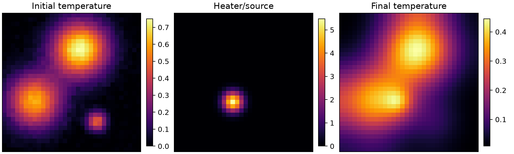

## Data Quality Control

Before training, `notebooks/01_synthetic_data_qc.ipynb` checks:

- shapes and dtypes
- finite values and value ranges
- alpha-channel consistency
- heater distributions
- OOD heater locations
- a physics sanity check: with zero-flux boundaries, diffusion should conserve spatial mean, so the mean temperature increase should match the source contribution

This step is important because bad simulation data would make any surrogate result meaningless.

## Surrogate Model

The project includes two surrogate models in `src/models.py`:

- a compact CNN baseline
- a small Fourier Neural Operator (FNO)

The model predicts the change from the initial condition:

```text
u_pred(T) = u0 + learned_delta
```

This residual form is useful because heat diffusion often changes the field smoothly from the initial state. Predicting a correction is easier than reconstructing the full final temperature field from scratch.

Current CNN settings:

- 5 convolutional blocks
- 64 hidden channels
- GELU activations
- batch normalization
- about 113k trainable parameters

The CNN is intentionally simple and provides a reliable baseline for comparison against the FNO.

Train locally with:

```bash
python3 src/train.py --model cnn --epochs 50 --batch-size 32 --run-name cnn_local_baseline_50ep
```

Train the FNO with:

```bash
python3 src/train_fno.py --epochs 50 --batch-size 32 --device cpu --run-name fno_local_50ep
```

On CUDA, use:

```bash
python3 src/train_fno.py --epochs 100 --batch-size 64 --device cuda --num-workers 4 --run-name fno_cuda_100ep
```

The FNO uses FFTs. If local Apple MPS has trouble with FFT/complex operations, CPU is the safest local option and CUDA is the better cluster option.

The training script saves:

- `logs/<run_name>/config.json`
- `logs/<run_name>/history.csv`
- `logs/<run_name>/metrics.json`
- `checkpoints/<run_name>_best.pt`
- `checkpoints/<run_name>_latest.pt`

This makes each run reproducible and easy to inspect.

## Model Results

Both the CNN and FNO were trained for 50 epochs. The CNN provides a local-convolution baseline, while the FNO learns global spatial interactions through Fourier-domain layers.

| Model | Parameters | Best epoch | Test MSE | Test relative L2 | Test max abs |
|---|---:|---:|---:|---:|---:|
| CNN | 113,153 | 44 | 2.22e-05 | 0.0444 | 0.0256 |
| FNO | 1,186,241 | 50 | 1.48e-06 | 0.0109 | 0.0057 |

The FNO substantially improves in-distribution accuracy, reducing test relative L2 error by about 75% compared with the CNN baseline.

### CNN Baseline

| Split | MSE | Relative L2 | Mean max abs error |
|---|---:|---:|---:|
| Validation | 2.33e-05 | 0.0449 | 0.0259 |
| Test | 2.22e-05 | 0.0444 | 0.0256 |
| OOD corner | 2.76e-05 | 0.0566 | 0.0341 |
| OOD multi-heater | 4.08e-05 | 0.0489 | 0.0356 |

### Fourier Neural Operator

| Split | MSE | Relative L2 | Mean max abs error |
|---|---:|---:|---:|
| Validation | 1.72e-06 | 0.0111 | 0.0058 |
| Test | 1.48e-06 | 0.0109 | 0.0057 |
| OOD corner | 2.26e-05 | 0.0476 | 0.0279 |
| OOD multi-heater | 1.50e-05 | 0.0264 | 0.0200 |

The FNO also improves OOD performance, though the gap between in-distribution and OOD error remains visible. This is useful for the digital twin framing: the surrogate is accurate on familiar heater configurations, but distribution shift still matters.

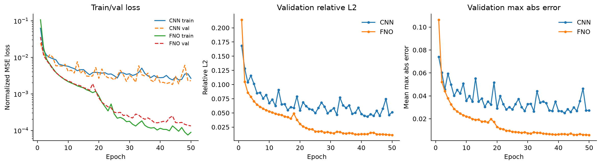

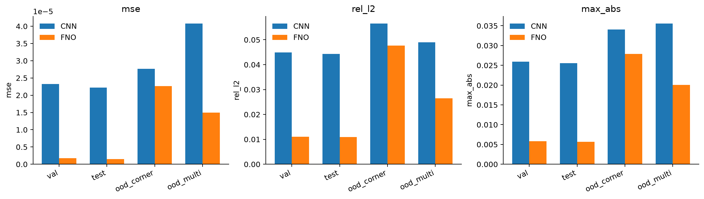

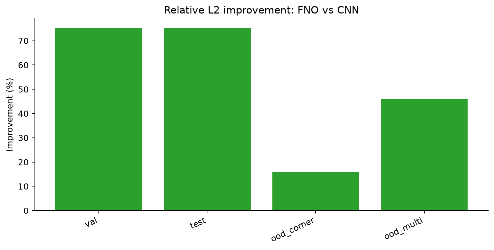

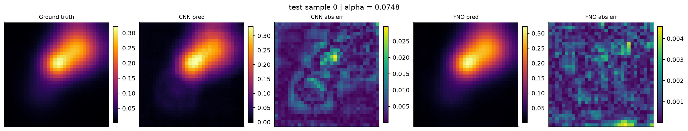

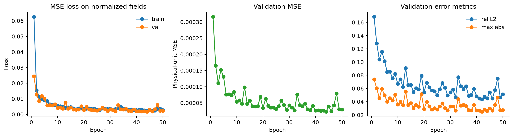

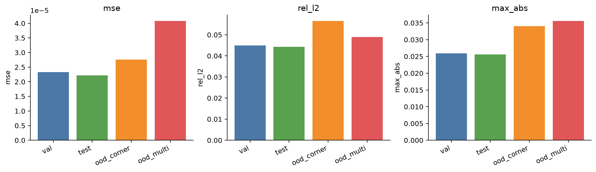

Example prediction on the held-out test set:

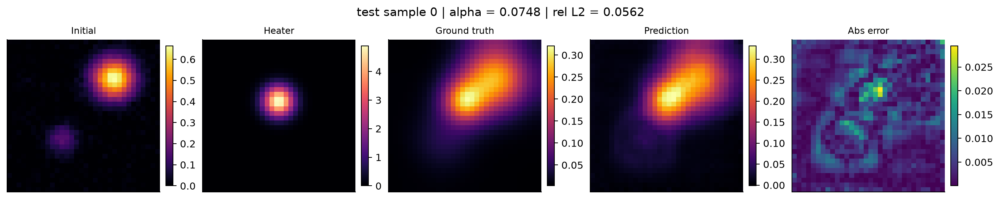

OOD examples:

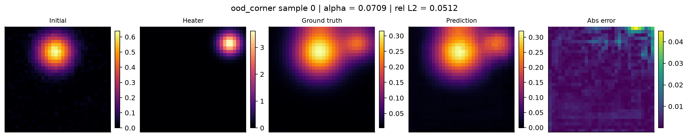

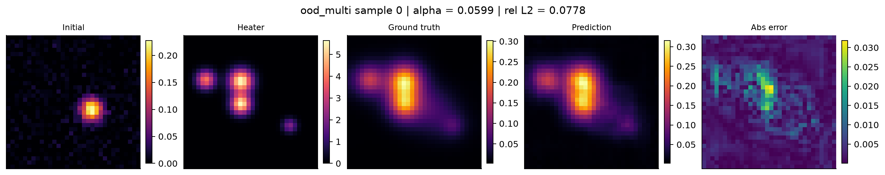

## Sparse-Sensor Calibration

For calibration, `alpha` is treated as unknown. The calibration routine uses only sparse noisy sensor readings from the final temperature field, then searches over candidate alpha values.

The finite-difference calibration procedure is:

1. Pick one held-out test simulation.
2. Hide the true alpha.
3. Sample 16 noisy sensor readings from the final temperature.
4. For each candidate alpha, rerun the finite-difference solver.
5. Compare predicted sensor values to observed sensor values.
6. Choose the alpha with the lowest sensor MSE.

Run:

```bash
python3 src/calibrate.py --sample-idx 0 --n-sensors 16 --noise-std 0.01
```

Result:

| Method | True alpha | Recovered alpha | Absolute error |
|---|---:|---:|---:|
| Finite difference | 0.0748 | 0.0700 | 0.0048 |

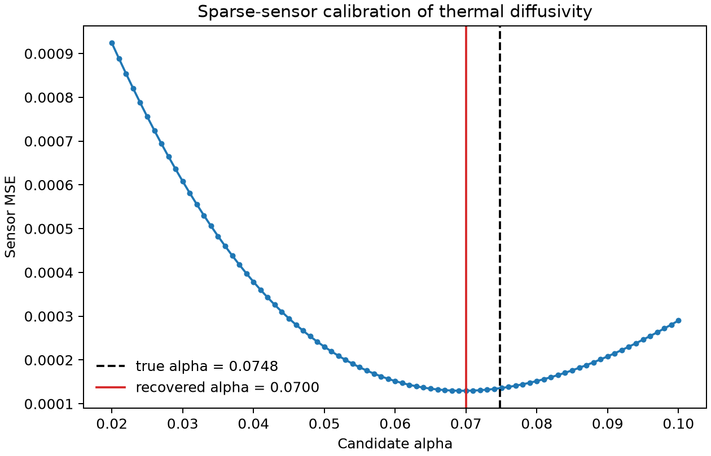

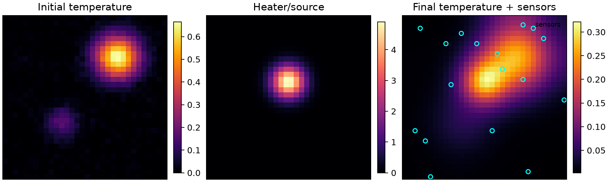

This is the digital twin update step: sparse observations are used to infer a hidden physical parameter.

## Surrogate-Based Calibration

Finite-difference calibration is also compared to surrogate calibration. The two methods use the same sensor locations and noisy observations.

The surrogate method does not rerun the PDE solver. Instead, for each candidate alpha, it changes the alpha input channel and evaluates the trained CNN.

Run:

```bash
python3 src/surrogate_calibrate.py \
  --checkpoint checkpoints/cnn_local_baseline_50ep_best.pt \
  --sample-idx 0 \
  --n-sensors 16 \
  --noise-std 0.01 \
  --device mps
```

Result:

| Method | True alpha | Recovered alpha | Absolute error | Best sensor MSE |
|---|---:|---:|---:|---:|
| Finite difference | 0.0748 | 0.0700 | 0.0048 | 1.30e-04 |
| CNN surrogate | 0.0748 | 0.0770 | 0.0022 | 1.26e-04 |

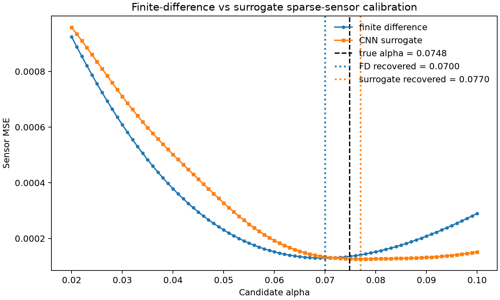

The surrogate calibration recovered alpha slightly closer to the true value on this sample. This single example is not a full calibration benchmark, but it demonstrates the intended workflow: once trained, a surrogate can be used inside a parameter search loop as a fast approximation to repeated simulation calls.

## Ensemble Uncertainty

Predictive uncertainty is estimated using three CNN models trained with different random seeds:

```bash
python3 src/train.py --epochs 30 --batch_size 32 --seed 0 --run-name cnn_ensemble_seed0
python3 src/train.py --epochs 30 --batch_size 32 --seed 1 --run-name cnn_ensemble_seed1
python3 src/train.py --epochs 30 --batch_size 32 --seed 2 --run-name cnn_ensemble_seed2
```

The script loads all three checkpoints and computes:

```text
prediction_mean = average model prediction
prediction_std  = standard deviation across model predictions
```

Run:

```bash
python3 src/uncertainty.py
```

For one held-out test sample:

| Quantity | Value |
|---|---:|
| Ensemble MSE | 1.96e-05 |
| Ensemble relative L2 | 0.0458 |
| Mean uncertainty | 2.20e-03 |
| Max uncertainty | 2.06e-02 |

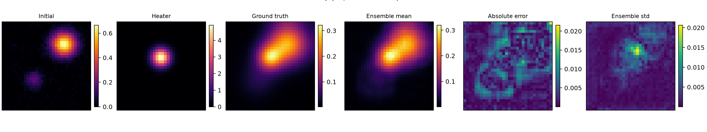

This is a lightweight uncertainty estimate, not a full Bayesian treatment. Still, it is practical and useful: disagreement across independently trained models highlights regions where the surrogate is less certain.

## Cluster Workflow

The repository includes a starter Slurm script:

```bash
sbatch scripts/train.slurm
```

The intended cluster workflow is:

1. Develop and debug locally.
2. Push code to GitHub.
3. Clone the repo on the MIT Engaging cluster.
4. Generate or copy data.
5. Run longer training jobs with Slurm.
6. Pull metrics and figures back into the README.

The training script is command-line driven so the same code can run locally or on the cluster.

## Technical Scope

The project covers the core components of a small scientific ML workflow:

- turning a PDE into a supervised operator-learning dataset
- checking synthetic data before training
- building a reproducible PyTorch training loop
- tracking run metadata, metrics, and checkpoints
- validating a surrogate against simulation data
- testing out-of-distribution behavior
- calibrating an unknown physical parameter from sparse sensors
- using ensembles to estimate uncertainty

The model is only one part of the system. The surrounding workflow -- simulation, validation, calibration, uncertainty, and reliability testing -- is what makes the project a digital twin workflow rather than only an image-to-image regression task.

## Current Limitations

- The FNO is trained on a small synthetic dataset; larger training sets would be needed for a stronger operator-learning benchmark.
- The simulator is intentionally simple: fixed grid, simple heaters, and constant alpha per sample.
- Calibration is demonstrated on a single sample; a stronger study would report statistics over many samples and sensor layouts.
- Ensemble uncertainty captures model disagreement, but not all sources of physical or observational uncertainty.
- The OOD tests are synthetic stress tests, not real experimental distribution shifts.

## Next Steps

Possible extensions:

- train on larger grids and evaluate resolution transfer
- add multi-step rollout prediction instead of only final-time prediction
- run calibration over many random samples
- report uncertainty-error correlation on OOD examples
- improve figure styling for publication-quality presentation

## Reproducing the Main Results

Install dependencies:

```bash
python3 -m pip install -r requirements.txt
```

Generate data:

```bash
python3 src/simulate.py
```

Train CNN baseline:

```bash
python3 src/train.py --model cnn --epochs 50 --batch-size 32 --run-name cnn_local_baseline_50ep
```

Train FNO:

```bash
python3 src/train_fno.py --epochs 50 --batch-size 32 --run-name fno_local_50ep
```

Analyze the run:

```bash
jupyter notebook notebooks/02_run_results_analysis.ipynb
```

Compare CNN and FNO:

```bash
jupyter notebook notebooks/03_compare_models.ipynb
```

Run finite-difference calibration:

```bash
python3 src/calibrate.py --sample-idx 0 --n-sensors 16 --noise-std 0.01
```

Run surrogate calibration comparison:

```bash
python3 src/surrogate_calibrate.py \
  --checkpoint checkpoints/cnn_local_baseline_50ep_best.pt \
  --sample-idx 0 \
  --n-sensors 16 \
  --noise-std 0.01
```

Run ensemble uncertainty:

```bash
python3 src/uncertainty.py
```
